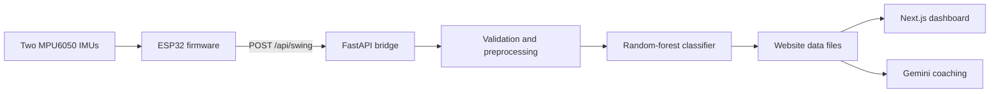

# DAVE - Dynamic Acronym Volleyball Evaluator

DAVE is a wearable volleyball swing-analysis system. Two MPU6050 IMUs on an ESP32 record the forearm and upper arm, a local Python pipeline reconstructs the motion and classifies the swing, and a Next.js dashboard replays it in 3D and provides optional Gemini-powered coaching.

### Why DAVE?
We couldnt think of the first 2 letters.

## How it works



The firmware calibrates both sensors, detects a swing from angular velocity, records synchronized telemetry, and sends JSON to the backend. The backend then:

1. validates and synchronizes the two IMU streams;
2. reconstructs shoulder, elbow, and wrist positions;
3. derives per-frame, motion-profile, and temporal features;
4. runs the random-forest classifier when a trained artifact is available;
5. atomically publishes a full replay payload and a smaller Gemini payload containg the frame-by-frame motion profiles & certain frames for the website.

## Repository layout

| Path | Purpose |
| --- | --- |
| `DAVE Hardware/` | PlatformIO firmware for an ESP32 and two MPU6050 sensors |
| `MLOps/Preprocessing/` | Validation, synchronization, interpolation, geometry, and feature extraction |
| `MLOps/Models/RF/` | Dataset loading, group-aware splitting, RF training, artifacts, and inference |
| `MLOps/API/` | FastAPI ingestion, persistence, pipeline orchestration, and frontend handoff |
| `MLOps/Postprocessing/` | Frontend and Gemini response assembly |
| `DAVE Website/` | Next.js dashboard, 3D replay, and Gemini chat route |
| `CommonUtils/` | Shared JSON parsing utilities |

## Quick start without hardware

### Prerequisites

- Python 3.12+
- [uv](https://docs.astral.sh/uv/)
- Node.js and npm (a current LTS release is recommended)
- Bash for the helper scripts (Linux, macOS, WSL, or Git Bash)

Install both application environments from the repository root:

```bash
./MLOps/scripts/setup.sh
npm install --prefix "DAVE Website"
```

Start the backend in one terminal:

```bash
./MLOps/scripts/run_pipeline.sh
```

Start the dashboard in another:

```bash
npm run dev
```

Open the website at `http://localhost:3000`. The API runs at `http://localhost:8000`; its interactive documentation is available at `http://localhost:8000/docs`.

**To ensure the connection is live and listening, run** `http://localhost:8000/health`

---

Submit a bundled example swing:

```bash
curl -X POST http://localhost:8000/api/swing \
  -H "Content-Type: application/json" \
  --data-binary @MLOps/Preprocessing/tests/fixtures/JSONtest_R.json
```

The response is a `202 Accepted` acknowledgment containing a `swing_id`. Processing runs in the background; refresh the dashboard or request `GET /api/swing/<swing_id>` after it completes.

The response also has multiple failure codes:
- `422 Unprocessable Content` - Invalid JSON or invalid swing payload such as missing fields
- `413 Payload Too Large` - Request Exceeds 4 MiB
- `500 Internal Server Error` - Incoming swing could not be saved
- `404 Not Found` - Processed results arent available yet for requested swing id

The verbose errors are returned to the sender for accurate calibration and health tracking.

The dashboard works without Gemini. To enable coaching, create `.env` with a Gemini API key in the repository root or `DAVE Website/`:

```dotenv
GEMINI_API_KEY=your_api_key
```

## Hardware setup

The firmware targets the PlatformIO `esp32doit-devkit-v1` environment. It expects:

- an ESP32 development board;
- two MPU6050 IMUs at I2C addresses `0x68` (forearm) and `0x69` (upper arm);
- SDA on GPIO 21 and SCL on GPIO 22;
- a Wi-Fi network from which the ESP32 can reach the backend.

Before flashing, edit the network constants near the top of `DAVE Hardware/src/main.cpp`: `WIFI_SSID`, `WIFI_PASS`, `SERVER_URL`, and, if needed, the static IP configuration. Do not commit real credentials. Then build and upload with PlatformIO:

```bash
cd "DAVE Hardware"
pio run
pio run --target upload
pio device monitor --baud 115200
```

At startup, hold the arm still for 2 seconds in the chosen reference pose (**ideal reference pose is holding arms at sides straight down**) while both sensors calibrate. The current firmware uses a 200 Hz recording target, a 350-sample buffer, and angular-velocity thresholds to start and stop capture; these constants can be tuned in `main.cpp`. However it is recommended not to adjust.

## API

| Method | Route | Description |
| --- | --- | --- |
| `GET` | `/health` | Runtime status, pipeline mode, and model availability |
| `POST` | `/api/swing` | Accept an ESP32 swing envelope and schedule processing |
| `GET` | `/api/swing/{swing_id}` | Return the completed frontend payload |
| `GET` | `/api/swing/{swing_id}/gemini` | Return the reduced coaching payload |

An input envelope contains `side` (`L` or `R`) plus nonempty `IMU 1` (forearm) and `IMU 2` (upper-arm) arrays. See the fixtures in `MLOps/Preprocessing/tests/fixtures/` for the complete sample schema. Requests default to a 4 MiB limit.

Processed data is stored under `MLOps/data/`. Website-ready files are published under `DAVE Website/data/`; generated runtime data is intentionally not versioned.

### Backend configuration

| Variable | Default | Meaning |
| --- | --- | --- |
| `DAVE_PIPELINE_MODE` | `system` | `system` analyzes swings; `database` collects label-ready training records |
| `DAVE_DATA_ROOT` | `MLOps/data` | Raw, processed, and failed record storage |
| `DAVE_DATABASE_ROOT` | `MLOps/Database` | Training collection storage |
| `DAVE_FRONTEND_DATA_ROOT` | `DAVE Website/data` | Website handoff directory |
| `DAVE_RF_ARTIFACT` | `MLOps/Models/RF/artifacts/rf_v1.joblib` | Trained model artifact |
| `DAVE_UPPER_ARM_LENGTH_M` | `0.25654` | Shoulder-to-elbow length of the person swinging (Meters) |
| `DAVE_FOREARM_LENGTH_M` | `0.26670` | Elbow-to-wrist length of the person swinging (Meters)|
| `DAVE_MAX_REQUEST_BYTES` | `4194304` | Maximum POST body size (Default: 4 MiB) |
| `DAVE_CORS_ORIGINS` | local ports 3000/5173 | Comma-separated allowed origins |

## Collecting data and training the classifier

Run the backend in database mode to archive raw recordings and create unlabeled motion-profile records:

```bash
./MLOps/scripts/run_pipeline.sh --mode database
```

Records appear in `MLOps/Database/training/`. Before training, set each record's `label` to `good` or `bad`. Use a shared `group_id` for related samples from the same athlete/session so the group-aware split keeps them together. Training requires both classes and enough distinct groups for both the training and validation sets.

Train and save the default artifact:

```bash
./MLOps/scripts/train_rf.sh
```

Additional CLI options may follow the dataset path, for example:

```bash
./MLOps/scripts/train_rf.sh MLOps/Database/training \
  --n-estimators 500 \
  --model-version 1.1.0
```

Restart the backend after training. Check `/health`: `model_loaded` should be `true`. Without an artifact, ingestion and replay still work, but the response marks classification as unavailable.

## Development checks

Run all in-process MLOps checks:

```bash
./MLOps/scripts/check_all.sh
```

Run the real localhost HTTP smoke test separately:

```bash
./MLOps/scripts/check_api_http.sh
```

Check the website:

```bash
npm run lint
npm run build
```

The preprocessing fixtures cover left- and right-arm payloads. The RF check trains a small temporary model and verifies artifact persistence and inference; it does not represent production model quality.

## Current limitations

- Sensor thresholds, body-segment lengths, Wi-Fi settings, and static IP settings are currently configured in source or environment variables rather than through a setup UI.
- The backend and website exchange generated files on a shared local filesystem, so the default architecture assumes they run from the same checkout or share the same data directory.
- FastAPI background tasks are process-local; this is designed as a local prototype, not a durable distributed job queue.
- A useful good/bad score depends on collecting, labeling, and validating a representative dataset. No trained production artifact is included by default.

## License

This project is licensed under the MIT License. See [LICENSE](LICENSE).
